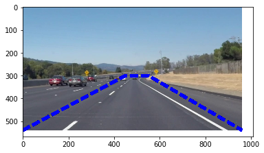

# **Finding Lane Lines on the Road** 

## Writeup Template

### You can use this file as a template for your writeup if you want to submit it as a markdown file. But feel free to use some other method and submit a pdf if you prefer.

---

**Finding Lane Lines on the Road**

The goals / steps of this project are the following:
* Make a pipeline that finds lane lines on the road
* Reflect on your work in a written report

[//]: # (Image References)

[image1]: ./examples/grayscale.jpg "/grayscale"

---

### Reflection

### 1. Describe your pipeline. As part of the description, explain how you modified the draw_lines() function.

My pipeline consisted of 5 steps. First, I converted the images to grayscale.

then I select the rigon of interest by vectors. the region is a trapezoid, which shows in the picture.

Thirdly, I smooth the picture by gaussian.which is essentially a way of suppressing noise and spurious gradients by averaging. because the lines are not the same color under different lighting conditions (day, night, etc) and even lines of the same color under may fail to be detected by our simple color selection, the canny method is best choice to detect edges. Then mask reigon of interest, we are suppose to draw the lines successfully. 

Fourthly, Transfer the lines to the hough coordinate. And separate right and left lines by positive and negative slops.

Next, I find the line endpoints, then extend the lines by a specific length. In this way, the dash lines could connect together.

For the challenge project, there are two problems.

First of all. under the shadow area, the program could not recoginze the road lines. Added a color mask in the range of [188,188,0] to [255,255,255] to the orignal picture. So the program could works again.

Secondly, the left line is off and on. In order to prevent jitterying, add a global variable for the line from the proir frame.

### 2. Identify potential shortcomings with your current pipeline

1. One potential shortcoming would be what would happen when the line is not a stright line. The line is still keep stright. 

２. Sometimes, the line is not identified.

### 3. Suggest possible improvements to your pipeline

1. The size of the line is too big, and the region of intetest would include some cars. 
